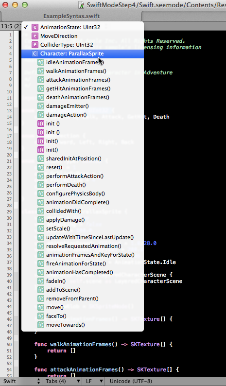

# Swift Mode Tutorial Step 4
## All the nice things

The next step is a somewhat mundane one, but crucial for great modes: Add all the Library classes and types.

We put them into the `scope="support."` hierachy. In our case `support.class.standard.cocoa`, `support.subroutine.standard.cocoa`,`support.type.cocoa`,
`support.class.standard.swift`, `support.subroutine.standard.swift`.

To extract the most of Swift I used an command click on a library function in Xcode 6, copied and pasted the header into a SubEthaEdit document and used regex to extract all the structs, types, and classes.

## Symbol Popup

Now that the basic elements of the mode are in order, lets head to the next functionality: the Symbol Popup. Currently nothing is shown there, and obviously we want to see classes, enums, and some pragma mark support in there.

The Symbol Popup is governed by the `RegexSymbols.xml` file, described in great detail here: [Symbol Definitions](https://github.com/codingmonkeys/SubEthaEdit/blob/master/Documentation/ExampleMode/Documentation/RegexSymbols_xml.md).

Our little helper script did already add a simple `RegexSymbols.xml` that does recognize versioning conflicts, and has 2 stubs for functions and pragma marks. Let's adjust the functions section so it recognizes basic Swift functions.

We already have our little identifier recognizer due to the keyword in the function regex: `([^-*+#:.,\(&lt;&gt;\{\[\]}\)\s]+)` so let's reuse it.

```xml
<symbol id="Functions" symbol="f()_#6AB18D" indentation="1" ignoreblocks="yes">
	<regex>^[^\S\n]*func\s+([^-*+#:.,\(&lt;&gt;\{\[\]}\)\s]+(?:&lt;[^&gt;\n]+&gt;)?\([^\)\n]+\))</regex>
	<postprocess>
		<find>\([^\)]*\)</find>
		<replace>()</replace>
		<find>[\n\r]</find>
		<replace> </replace>
		<find>[ \t]+</find>
		<replace> </replace>
	</postprocess>
</symbol>
```
So let's see: we want something at the start of the line that has whitespace but no newline before the `func` keyword, which is followed by an identifier optionally followed by a generic `<>` and then followd by a round bracket opening and closing.

The `postprocess` tag does then remove all content between the normal brackets.



## Autocomplete

__SubEthaEdit__ supports a manually triggered autocomplete using the Escape Key. As autocomplete source all text in all open documents for that Mode are considered. On top of that for all the `keywords` that we specified the `useforautocomplete="yes"` all the `string` entries are considered as well. To be of even more use there is also the `AutocompleteAdditions.txt` which is used for lookup as well, in that you should place all the things you don't want to highlight, or you highlighted with regexes. For Example in the Objective-C mode there are all the Cocoa selectors. The Format is simple, just one line for each possible complete in a standard text file.

So lets fill this up with all the identifiers and accessors in the Swift base module generated by Xcode when cmd-clicking on them. As a first approach I tried just getting all the information out of it using some of the regexes we already produced. E.g. all the func's in the Header

	(?:func)\s+([^-*+#:.,\(<>\{\[\]}\)\s]+)(?:<[^>\n]+>)?\([^\)\n]+\)

- just to illustrate: put that into the search field with regexes on in SubEthaEdit. Press find all. Select all in the find all list. Copy it into a new document, run the regex with replace \1 again.

However, I did choose another approach: remove all the comments, punctuation and other noise from the document and put it all in a long file. I did this mainly with regexes directly in SubEthaEdit with the occasional pipe through the `sort` and `uniq` command line tools using the script menu.
 


<!-- Tutorial Navigation -->
[Step 3: Regex based Keywords](../SwiftModeStep3) - [Overview](..) - [Step 5: Mode recognition and Scripts](../SwiftModeStep5)
